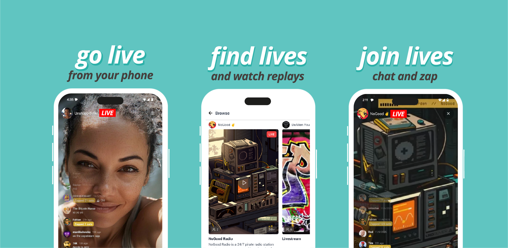
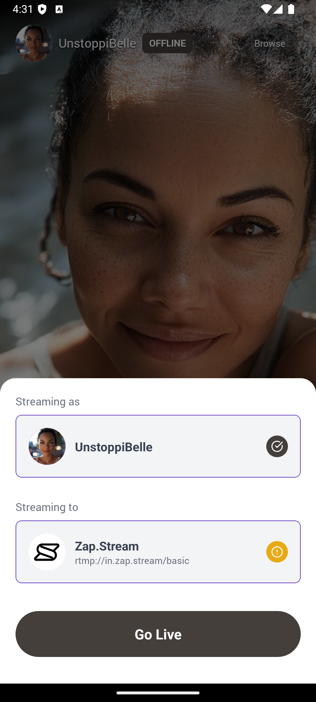
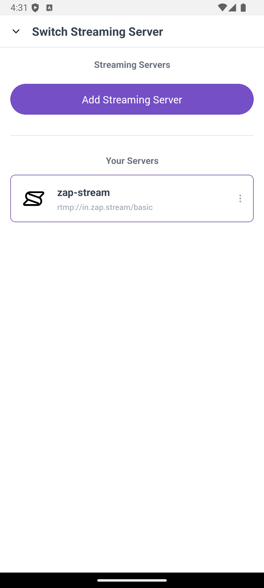
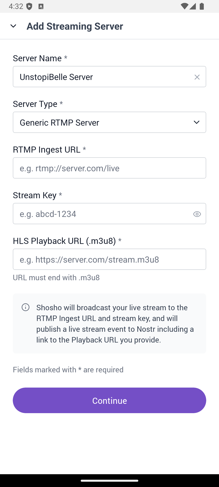

# Shosho – Live Stream on Nostr

  

Stream your camera and chat with your friends and followers on Nostr live!

Shosho is a mobile app that enables live streaming over RTMP with Nostr integration, similar to Facebook Live but built on the Nostr protocol. It streams to zap.stream servers and announces your stream to the Nostr network, creating a seamless experience for you as a streamer, and for your friends and followers on Nostr.

  
  
  
  
  

## Shosho Features

- **Live Stream Broadcasting**: live video streaming with RTMP
- **Live Chat**: See your mentions and stream chat live and respond in the app
- **Find Lives**: Discover featured lives and streamers
- **Join Lives**: Join livestreams and watch replays in full screen
- **Nostr Native**: Use your Nostr npub, announce your stream live on Nostr clients like Shosho, Zap.Stream, and Amethyst
- **Use Any Server**: Stream to Zap.Stream or any other RTMP server you like
- **Zap Integration**: Receive zaps from your viewers and get paid to stream

## Install Shosho

### Android

#### From Google Play Store

1. Visit [Shosho on Google Play Store](https://play.google.com/store/apps/details?id=com.shosho.app)
2. Install and receive automatic updates

#### From GitHub

1. Download the latest APK from the [releases page](https://github.com/r0d8lsh0p/shosho-releases/releases)
2. Enable "Install from Unknown Sources" in your device settings
3. Open the downloaded APK to install

#### From Obtainium

1. Install [Obtainium](https://github.com/ImranR98/Obtainium) from F-Droid or GitHub
2. Add Shosho using the GitHub source: `r0d8lsh0p/shosho-releases`
3. Install and receive automatic updates

#### From ZapStore

1. Install [Zapstore](https://zapstore.dev/)
2. Search for "shosho"
3. Install and receive automatic updates

### iOS

#### From Apple TestFlight

1. Visit [Shosho on Apple TestFlight](https://testflight.apple.com/join/Cg4Ng6dq)
2. Get the [TestFlight App from Apple](https://apps.apple.com/us/app/testflight/id899247664?mt=8) (if not already installed)
3. Install shosho from TestFlight and receive automatic updates

## Use Any Streaming Server

You can set up Shosho to broadcast to any streaming server of your choice, either a Nostr streaming server like Zap.Stream or any Generic RTMP server. Regardless of what you choose your stream event will be broadcast over Nostr so that users of Shosho, Zap.Stream, Amethyst and others can find and view your stream. 

Follow these steps:

| Step 1 | Step 2 | Step 3 |
|--------|--------|--------|
|  |  |  |
| Press the server  to configure your servers. | Add new or select  an existing server. | Supports Nostr or  Generic RTMP servers. |

## Changelog

See the [CHANGELOG.md](CHANGELOG.md) for a detailed history of changes.

## License

This application is distributed as closed-source software for the moment. This APK is provided for installation purposes only. Redistribution is permitted, but modification is prohibited.

## Support

For support please message us on Nostr

- [Rod](http://njump.me/npub1r0d8u8mnj6769500nypnm28a9hpk9qg8jr0ehe30tygr3wuhcnvs4rfsft)
- [Shosho](http://njump.me/npub1sh0spghk4yvy2d2v35kelw45qq4msk6zykaw4ds047e9slzs8r4qr7q2xa)
